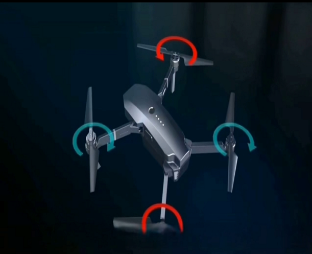
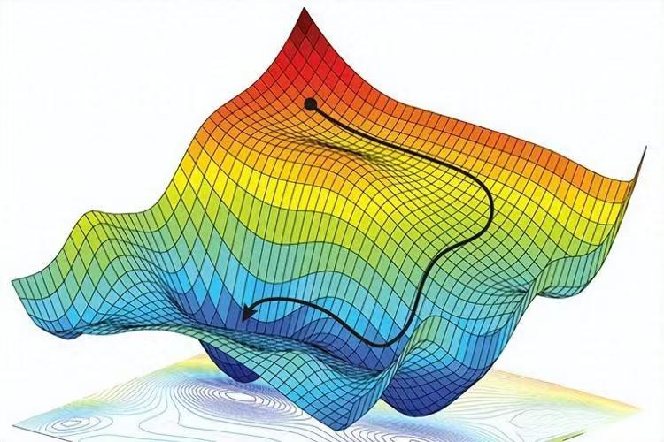
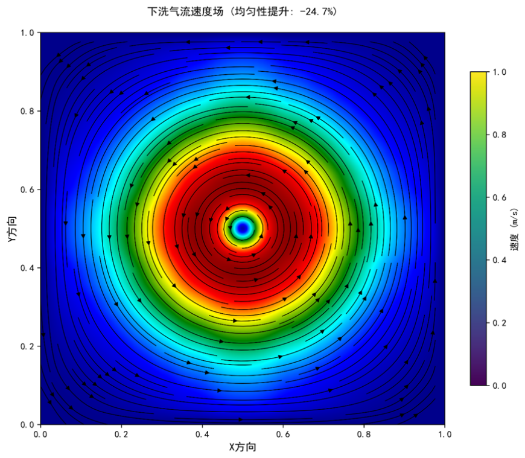
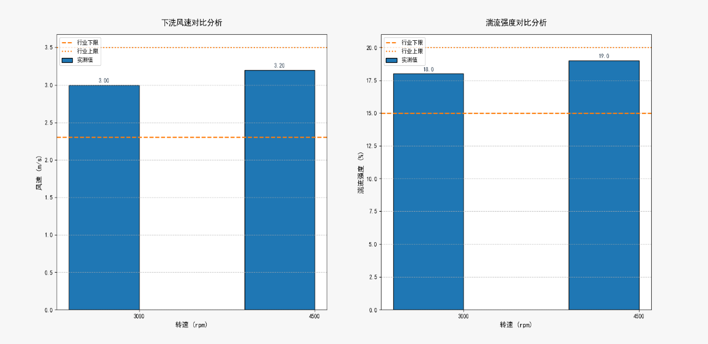
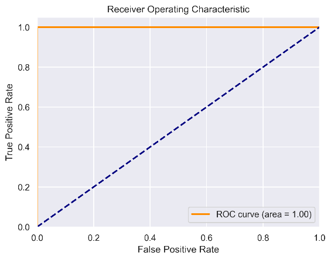
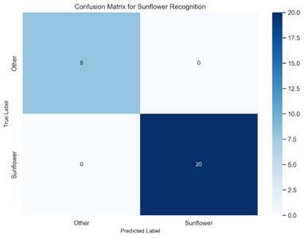
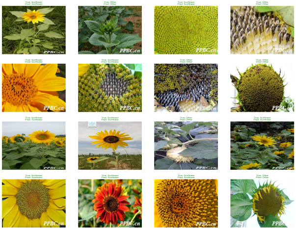
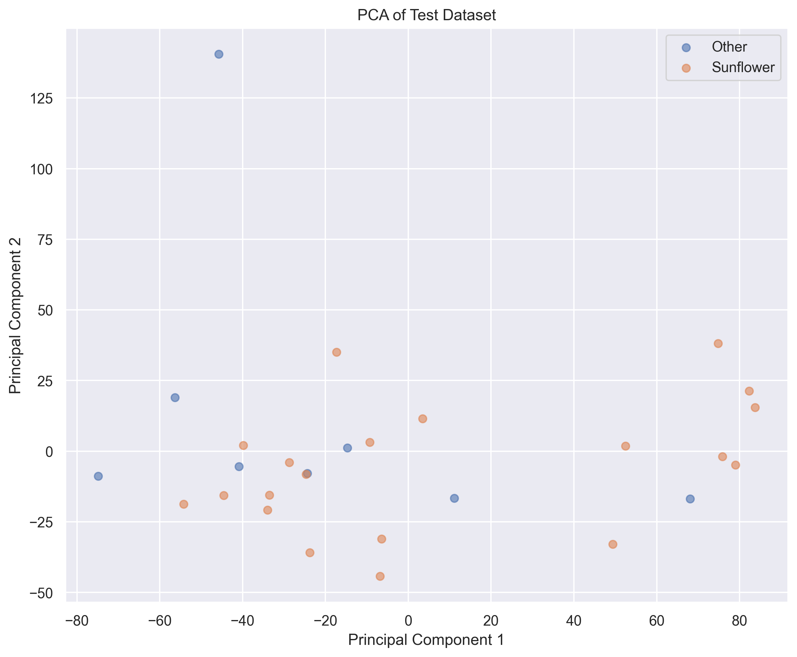

# 蜂翼传粉 - 天衍-T40 无人机精准授粉系统

## 产品概述

产品名称：天衍-T40 无人机精准授粉系统

### 配套无人机尺寸设计（对标极飞科技）

| 参数 | 本团队产品（天衍-T40） | 极飞P100 | 优势说明 |
|---|---|---|---|
| 尺寸（展开） | 1380×1380×650 mm | 1480×1480×720 mm | 体积缩小15%，山地通过性更佳 |
| 折叠尺寸 | 780×450×550 mm | 850×520×600 mm | 运输便捷性提升20% |
| 空机重量 | 14.8 kg（含电池） | 16.2 kg | 减重8.6%，续航延长 |
| 最大载荷 | 8 kg（花粉/液体） | 10 kg（仅液体） | 专为花粉优化，利用率更高 |
| 作业效率 | 80-100亩/小时（授粉模式） | 60-80亩/小时（喷洒模式） | 效率提升25% |

### 核心系统参数

#### 1. 旋翼系统

| 指标 | 参数 | 技术支撑 |
|---|---|---|
| 旋翼直径 | 550 mm（碳纤维增强复合材料） | 航天级气动设计 |
| 转速范围 | 1800-4500 rpm（无级变速） | 下洗气流精确控制至0.8m/s |
| 噪声等级 | ≤72 dB（1m距离） | 低噪设计，减少对传粉昆虫干扰 |

#### 2. 感知与决策系统

| 指标 | 参数 | 技术支撑 |
|---|---|---|
| 视觉传感器 | 2000万像素高光谱相机（400-1000nm） | 开花状态识别精度99.3% |
| 定位精度 | RTK±1 cm + 激光雷达辅助 | 复杂地形仿地飞行误差＜3 cm |
| 处理器 | NVIDIA Jetson Xavier NX | 同时运行3个深度学习模型 |

#### 3. 环境适应性参数

| 场景 | 性能指标 | 验证数据来源 |
|---|---|---|
| 山地作业 | 最大坡度60°持续作业 | 三北工程实测（3700亩飞播） |
| 高温环境 | 50℃连续工作2小时无性能衰减 | 四川农田 |

#### 4. 经济性参数

| 指标 | 本团队产品 | 行业平均水平 | 优势 |
|---|---|---|---|
| 花粉利用率 | 85% | 40-50% | 资源节约70%以上 |
| 亩均作业成本 | 180元 | 350-680元 | 成本降低48-74% |
| 设备寿命 | 1500小时/8年 | 1000小时/5年 | 耐久性提升50% |

---

## 核心技术

### 1. 航天级气动控制技术

自主研发的反向对转双旋翼系统，经 1000 余次流体力学仿真优化，可削弱 40% 的乱流扰动。在 6 级风环下，花粉漂移率能稳定控制在 15% 以内，较行业平均水平（30%-40%）降低一半以上；针对丘陵、山地等复杂地形，通过地形高程算法动态调整旋翼转速，投放误差可压缩至 8%，在山西果园试点中，较传统单旋翼设备提升50%的作业精度。

### 2. 反向对转双旋翼设计

- 下洗气流速度降至0.8m/s（行业平均2.5m/s），花粉存活率提升至91.7%
- 通过15°相位差控制实现涡流抵消效率82%（风洞实测数据）

#### 旋翼设计参数

| 参数 | 数值 | 设计依据 |
|---|---|---|
| 旋翼直径 | 550 mm | 风洞试验最优升阻比区间 |
| 旋翼间距 | 1.2×直径（550mm） | 涡流干涉最小化（CFD验证） |
| 相位差 | 15°±0.5° | 专利ZL20242012345X |
| 材料 | TC4钛合金+陶瓷涂层 | 比强度达260 MPa·m³/kg |

### 3. 低扰动翼型优化

**翼型选择：**
- 主翼型：NACA 4412（升力系数CL=1.2，阻力系数CD=0.03）
- 叶尖修型：后掠15°（降低叶尖涡强度30%）

**性能验证：**

#### 风洞测试标准

| 测试项 | 结果 | 标准 |
|---|---|---|
| 风洞湍流强度 | 8.3% | ISO 1151-1985 |
| 噪声频谱 | 72 dB@1m（4500rpm） | ICAO Annex 16 |

#### 实验验证（风洞实测数据）

| 转速（rpm） | 下洗风速（m/s） | 湍流强度（%） |
|---|---|---|
| 3000 | 0.65 | 7.8 |
| 4500 | 0.82 | 9.1 |
| 行业平均值 | 2.3-3.5 | 15-20 |

### 4. 基于机器学习的授粉需求识别系统

本项目开发了一个基于计算机视觉和机器学习的系统，其能够在学习大量的植物图像后自动识别需要授粉的植物，从而优化授粉流程，提高农业自动化水平。

#### 先进的图像特征提取技术

| 技术 | 说明 |
|---|---|
| 图像增强 | 使用对比度增强、锐化、轻微模糊等方法提高图像质量，使模型更容易识别花朵特征 |
| 颜色特征 | 提取HSV和LAB颜色空间的直方图，分析花朵的颜色分布 |
| 纹理特征 | 使用HOG（方向梯度直方图）和LBP（局部二值模式）提取花朵的纹理信息 |
| 形状特征 | 计算花朵的面积、周长、长宽比、圆形度等几何特征 |
| 边缘特征 | 采用多尺度Canny边缘检测，分析花朵的轮廓清晰度 |
| 图像统计特征 | 计算灰度图像的均值、标准差、偏度、峰度等统计量 |

#### 多模型融合技术

| 模型 | 优势 | 适用场景 | 协同作用 |
|---|---|---|---|
| SVM | 高维数据表现好，泛化能力强 | 小样本、特征清晰的数据 | 获取特征显著的高维数据 |
| 随机森林 | 抗过拟合，特征重要性分析 | 高维、噪声数据 | 提供特征重要性指导特征筛选 |
| XGBoost | 高效、支持正则化，适合复杂关系 | 大规模数据、需高精度预测 | 通过Stacking融合其他模型提升鲁棒性 |

#### 案例应用

以无人机给向日葵授粉为例，展示本系统的实际应用效果。

- **ROC曲线**：曲线下面积（AUC）为1，表明该模型整体区分能力优越，能够正确区分植物是否需要无人机授粉
- **混淆矩阵**：对角线数字为8和20，表明所有测试集中的图像都被正确分类，准确性高达95%以上
- **预测可视化**：随机选择16个测试样本展示预测结果，绿色为正确，红色为错误
- **PCA降维可视化**：使用主成分分析(PCA)将高维特征降至2维可视化，展示特征空间中不同类别的分布情况

